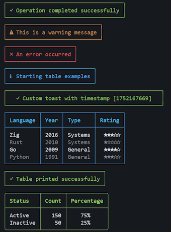
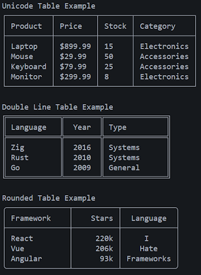

## Example usage

```zig
const axiom = @import("axiom");

var table = axiom.Table.init(std.heap.page_allocator, .rounded);
defer table.deinit();

try table.addColumn("Name", 10, .left);
try table.addColumn("Age", 5, .right);
try table.addColumn("City", 12, .center);
try table.addRow(&[_][]const u8{ "Alice", "25", "New York" });
try table.addRow(&[_][]const u8{ "Bob", "30", "Los Angeles" });
try table.printTable();
```

## Preview




---

No warranty. Not ever.
